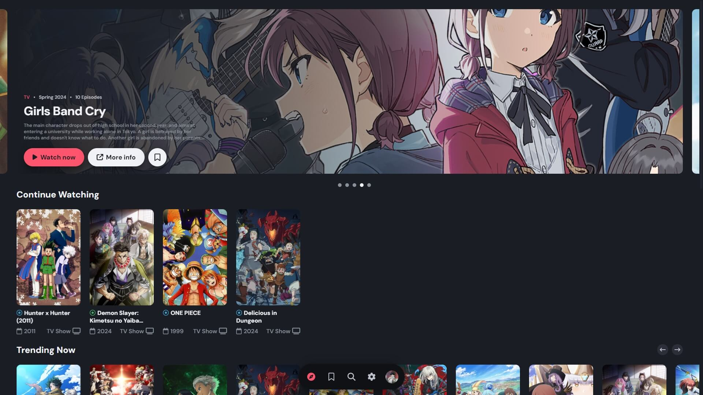

<p align="center">
    
    <h1 align="center">akuse</h1>
</p>

<p align="center">Simple and easy to use anime streaming desktop app without ads.</p>

<p align="center">
     
    
    
    <a href="https://discord.gg/f3wdnqSNX5">
        
    </a>
</p>

<p align="center" style="text-decoration: none;">
    <a href="https://github.com/akuse-app/akuse/releases/latest">
        
    </a>
</p>

<p align="center">
    <a href="https://ko-fi.com/aleganza">
      
    </a>
</p>



<br/>

# Why should you choose akuse?

- **🚀 Fast:** Smooth and quick streaming with minimal buffering.
- **🎨 Sleek UI:** User-friendly and eye-catching.
- **🔄 Reliable:** Regular updates and fresh content.

<br/>

# Other info
<details>
  <summary><h2>🗺 Languages</h2></summary>

  - Italian
  - English
</details>

<details>
  <summary><h2>⚙️ Running locally for development</h2></summary>


  Start cloning akuse:

  ```
  git clone https://github.com/akuse-app/akuse.git
  ```
  
  Next, go to [this link](https://anilist.co/settings/developer) and create a new AniList API Client.
  As Redirect Uri, you can insert `akuse://index,https://anilist.co/api/v2/oauth/pin` (these are two space seprated uri) and it should work.
  Now go inside the src/modules folder and create a clientData.ts file with a structure like this:
  
  ```bash
  import { ClientData } from "../types/types";
  
  export const clientData: ClientData = {
    clientId: ,
    redirectUri: "",
    clientSecret: "",
  };
  ```
  
  Fill it with the data retrieved from the creation of your AniList API Client.
  
  ```bash
  # Example:
  import { ClientData } from "../types/types";
  
  export const clientData: ClientData = {
    clientId: 12345,
    redirectUri: 'akuse://index',
    clientSecret: 'iA04TKLO3k3LaVWhxucJwck0glR6uhiv',
  };
  ```
  
  Next, install its dependencies (make sure npm is installed on your machine):
  
  ```
  npm install
  ```
  
  To start, run:
  
  ```
  npm start
  ```
</details>
<details>
  <summary><h2>⚠ How to Log-In in AppImage & Development</h2></summary>
  

  In AppImage and in a Development environment, the Log-In redirect doesn't work since the app is not packed/installed. If you need to work with an authenticated instance, follow these steps:
  1. open the app using one of the method e.g.
  
      ```
      npm start
      ```
        or
      ```
      ./path/to/app.AppImage
      ```
      
  2. Now click on the login button and authenticate in the browser. Next, copy the code you are given, go back to akuse and click the navbar element with a laptop icon. Here you can paste your code.
  
  3. Finally, paste your code and push the button. If the code you entered is correct, you are now Logged-in, othwerise repeat these steps and see what has gone wrong.
  
  **NOTE:** This is not needed in Installed App.
</details>
<details>
  <summary><h2>⌨ Shortcuts</h2></summary>


  - Pages
    - F1: go to Discover page
    - F2: go to Library page
    - F3: go to Search page
  - Video player
    - Space: play/pause video
    - Left arrow: fast rewind (5s)
    - Right arrow: fast forward (5s)
    - Upper arrow: increase volume
    - Lower arrow: decrease volume
    - F11: fullscreen toggler
    - F: fullscreen toggler
    - M: mute/unmute video
    - P: play previous episode
    - N: play next episode
</details>

## 🐛 Known Issues

- If Log-In in installed apps doesn't work, make sure you have set a default browser.
- Some anime may not work due to different names compared to AniList. Feel free to open a new issue if you find any, so they can be fixed.

## 🌟 Contributors

[](https://github.com/akuse-app/akuse/graphs/contributors)

## 🙌 Credits

- [Consumet API](https://github.com/consumet/consumet.ts): used to fetch episodes links
- [This API](https://api.ani.zip/mappings?anilist_id=21): used to fetch episodes info and thumbnails
- [AniSkip API](https://api.aniskip.com/api-docs#/skip-times/SkipTimesControllerV2_getSkipTimes): used to fetch episode intros & outros.
- [Aniwatch API](https://github.com/ghoshRitesh12/aniwatch-api): used to get hianime episode sources if consumet fails to.
<br/>

# Legal

## 📢 Disclaimer

- akuse helps users find anime by simply scraping links from various websites.
- akuse or its developers do not host the content found on akuse. All images and anime information found in the app are retrieved from AniList public API.
- Additionally, all anime links found on akuse are from various third party anime hosting websites.
- akuse or its owner are not responsible for the misuse of any content inside or outside the app and shall not be responsible for the dissemination of any content within the app.
- By using this app, you agree that the app developer is not responsible for the content within the app. Nevertheless, they may or may not come from legitimate sources.
- For internet violations, please contact the source website. The developer is not legally responsible.

## 📜 License

Licensed under [GPL-3.0](https://www.gnu.org/licenses/gpl-3.0.html#license-text).
